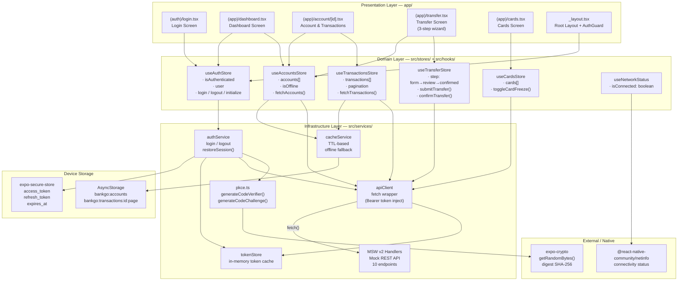
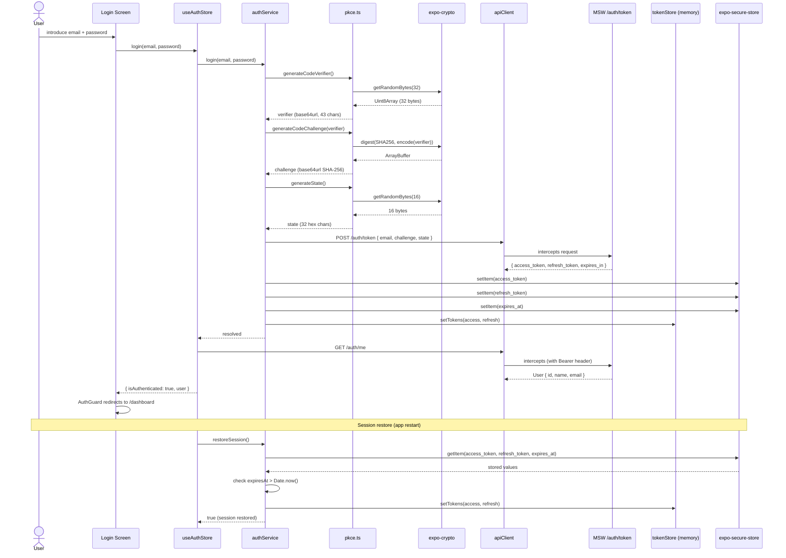
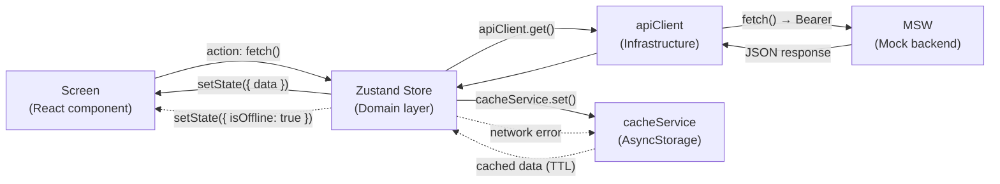

# BankGo — Arquitectura del Sistema

> Última actualización: 2026-04-30

---

## Diagrama de arquitectura



---

## Diagrama de flujo de autenticación



---

## Diagrama de flujo de datos (offline-first)



---

## Estructura de directorios

```
bankgo/
├── app/                          # Expo Router — File-based routing
│   ├── _layout.tsx               # Root layout + AuthGuard + MSW bootstrap
│   ├── (auth)/
│   │   ├── _layout.tsx           # Unauthenticated group layout
│   │   └── login.tsx             # Login screen
│   └── (app)/
│       ├── _layout.tsx           # Authenticated group layout (tab bar)
│       ├── dashboard.tsx         # Dashboard con lista de cuentas
│       ├── transfer.tsx          # Wizard de transferencia (3 pasos)
│       ├── cards.tsx             # Lista de tarjetas con toggle freeze
│       └── account/
│           └── [id].tsx          # Transacciones paginadas de una cuenta
│
├── src/
│   ├── types/
│   │   └── index.ts              # Domain types (User, Account, Card, Transfer…)
│   ├── stores/                   # Zustand stores — Domain layer
│   │   ├── authStore.ts          # Auth state + login/logout/initialize
│   │   ├── accountsStore.ts      # Accounts + offline-first cache
│   │   ├── transactionsStore.ts  # Paginated transactions + cache
│   │   ├── transferStore.ts      # 3-step transfer wizard state
│   │   └── cardsStore.ts         # Cards + optimistic freeze toggle
│   ├── services/                 # Infrastructure layer
│   │   ├── api/
│   │   │   ├── client.ts         # fetch wrapper con Bearer inject
│   │   │   ├── handlers.ts       # MSW request handlers (10 endpoints)
│   │   │   ├── seed.ts           # Mock data (user, accounts, transactions…)
│   │   │   └── setup.ts          # MSW server bootstrap
│   │   ├── auth/
│   │   │   ├── authService.ts    # Login / logout / restoreSession
│   │   │   ├── pkce.ts           # PKCE RFC 7636 (verifier + challenge)
│   │   │   └── tokenStore.ts     # In-memory token cache (never logged)
│   │   └── cache/
│   │       └── cacheService.ts   # TTL-based AsyncStorage cache
│   ├── hooks/
│   │   └── useNetworkStatus.ts   # Network connectivity hook
│   ├── components/
│   │   └── ui/
│   │       ├── AccountCard.tsx
│   │       ├── TransactionItem.tsx
│   │       ├── OfflineBanner.tsx
│   │       ├── EmptyState.tsx
│   │       ├── ErrorState.tsx
│   │       ├── LoadingState.tsx
│   │       ├── ConfirmationDialog.tsx
│   │       └── InAppNotification.tsx
│   └── utils/
│       └── logger.ts             # Sanitizing logger (redacta tokens/passwords)
│
├── __tests__/                    # Jest test suites (25 tests, 5 suites)
│   ├── services/
│   │   ├── pkce.test.ts
│   │   ├── cache.test.ts
│   │   └── logger.test.ts
│   └── stores/
│       ├── accountsStore.test.ts
│       └── transferStore.test.ts
│
├── docs/                         # Documentación técnica
│   ├── architecture.md           # Este documento
│   ├── technical-decisions.md    # ADRs
│   ├── ai-usage.md               # Uso de IA en el desarrollo
│   └── wireframes/
│       └── flow.md               # Wireframes ASCII del flujo principal
│
└── .github/
    └── workflows/
        └── ci.yml                # GitHub Actions CI/CD
```

---

## Decisiones de arquitectura clave

### Expo Router en vez de React Navigation standalone

Expo Router es file-based routing built on top de React Navigation. La decisión evita escribir boilerplate de `NavigationContainer`, `Stack.Navigator` y params drilling manual. El sistema de grupos `(auth)` y `(app)` permite separar rutas autenticadas de públicas con `_layout.tsx` por grupo — el `AuthGuard` vive en el root layout y redirige según `isAuthenticated`. Expo Router también habilita deep linking y URL-based navigation out of the box.

### Zustand en vez de Redux/Context

Zustand v5 ofrece stores sin boilerplate (no actions, no reducers, no dispatch). Cada store es un módulo independiente que se suscribe solo al slice de estado que necesita. El patrón `create<State>((set, get) => ...)` es suficientemente expresivo para lógica de dominio compleja (validación, optimistic updates, cache fallback) sin necesidad de middleware adicional como Thunk o Saga. Context API re-renderiza todo el árbol; Zustand suscribe selectivamente.

### MSW v2 en vez de JSON Server

MSW (Mock Service Worker) intercepta `fetch()` a nivel de Service Worker en browser y a nivel de `node:http` interceptor en Node/test. No requiere proceso separado ni puerto. Los handlers son código TypeScript tipado que comparte los mismos tipos del dominio (`Transfer`, `Account`, etc.). MSW v2 introduce un API más limpio con `http.get/post/patch` y `HttpResponse`. En tests, el mismo servidor MSW funciona sin cambiar nada — `setupMockServer()` detecta el entorno automáticamente.

### AsyncStorage para cache, SecureStore para tokens

Son dos threat models distintos. AsyncStorage es plain text — apropiado para datos de negocio no sensibles (saldos, transacciones) donde el beneficio de la disponibilidad offline supera el riesgo de exposición. SecureStore usa el keychain del OS (Keychain Services en iOS, Android Keystore) — apropiado para tokens que pueden autenticar requests arbitrarios. Mezclar ambos en el mismo storage sería un downgrade de seguridad para los tokens.

### Patrón offline-first

`accountsStore` y `transactionsStore` implementan el patrón: (1) intentar network request, (2) si falla, leer cache de AsyncStorage con TTL, (3) si hay cache válido, mostrar datos con banner `isOffline: true`. Si no hay cache, mostrar error. `cacheService` maneja la serialización/deserialización y la invalidación por TTL (5 min cuentas, 2 min transacciones). El flag `isOffline` en el store propaga el estado al componente `OfflineBanner`.

---

## Consideraciones de seguridad (OWASP Mobile Top 10)

### M1 — Improper Credential Usage

**Implementado:** PKCE (RFC 7636) en el flujo de autenticación. El `code_verifier` se genera con `expo-crypto.getRandomBytes(32)` — criptográficamente seguro. El `code_challenge` es `SHA-256(verifier)` en base64url. Los tokens se persisten exclusivamente en `expo-secure-store` (keychain del OS), nunca en AsyncStorage ni en memoria más allá del tiempo de sesión. La contraseña no se almacena en ningún momento — solo viaja en el body del request de login al mock.

**Pendiente:** En producción, el flujo PKCE real involucra un authorization server externo. El mock simula el exchange pero no la redirección OAuth.

### M2 — Inadequate Supply Chain Security

**Implementado:** `package-lock.json` garantiza versiones exactas (lock file). GitHub Actions usa `npm ci` (no `npm install`) que respeta el lock file. Las dependencias son mínimas y bien mantenidas (Expo ecosystem, Zustand, MSW).

**Pendiente:** `npm audit` en el pipeline de CI para detectar vulnerabilidades conocidas. Dependabot para actualizaciones automáticas.

### M4 — Insufficient Input/Output Validation

**Implementado:** El transferStore valida en `validate()` antes de hacer POST: `fromAccountId` no null, `beneficiaryId` no null, `amount > 0`, saldo suficiente. El MSW handler valida los mismos campos server-side y retorna `422 VALIDATION_ERROR` si fallan.

### M8 — Security Misconfiguration

**Implementado:** `logger.ts` tiene un sanitizer que redacta patrones de Bearer token, `access_token`, `refresh_token`, y `password` antes de logear. `tokenStore` nunca loguea valores reales — solo `[REDACTED]`. Los handlers de MSW loguean `tokens=[REDACTED]` explícitamente.

**Pendiente:** Certificate pinning para prevenir man-in-the-middle en producción. Actualmente el mock usa plain HTTP sin TLS. En producción con un backend real, se implementaría con `expo-build-properties` + TrustKit (iOS) / OkHttp CertificatePinner (Android).

### M9 — Insecure Data Storage

**Implementado:** Separación estricta: datos sensibles (tokens) → SecureStore; datos de negocio (cache) → AsyncStorage. No se almacenan credenciales, números de cuenta completos, ni PII en AsyncStorage.

**Pendiente:** Encriptación adicional del cache de AsyncStorage para datos de alta sensibilidad (saldos). Implementable con `react-native-mmkv` con encriptación o un wrapper de AsyncStorage con AES.
